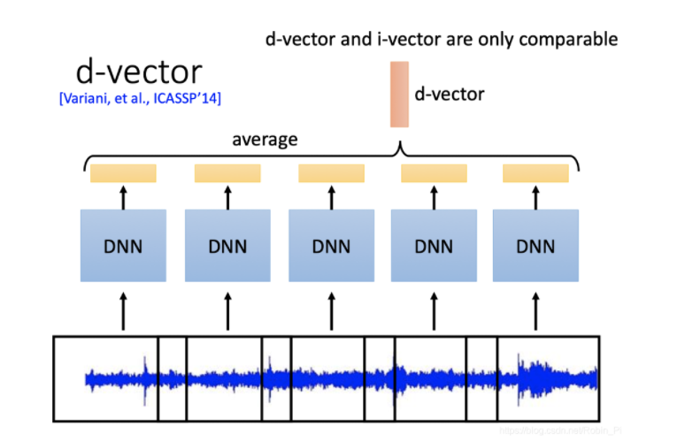
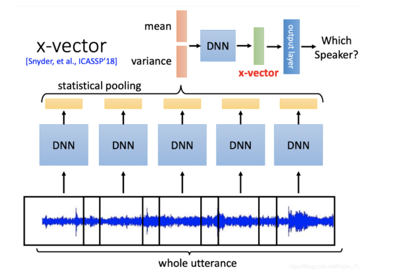

# Speaker_Verification-

**d-vector**

LSTM-based d-vector. GE2E LOSS

example:[dvector/dvector.py at master · yistLin/dvector (github.com)](https://github.com/yistLin/dvector/blob/master/modules/dvector.py)

**x-vector**

TDNN based x-vector 

example:[pytorch_xvectors/models.py at master · manojpamk/pytorch_xvectors (github.com)](https://github.com/manojpamk/pytorch_xvectors/blob/master/models.py)

